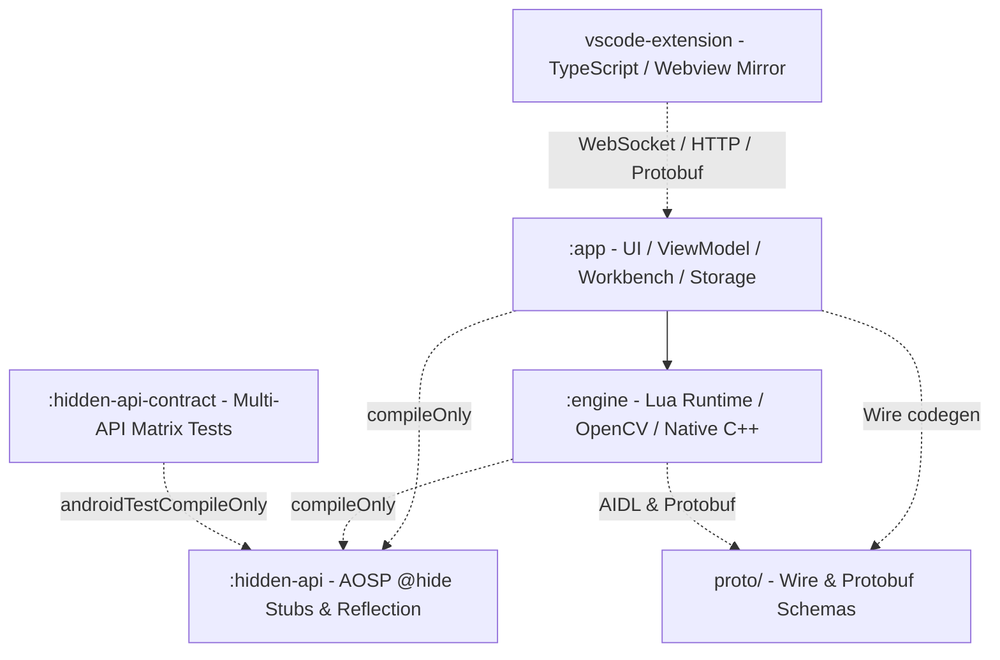

# ReLC 架構與實作指引 (Implementation Guide)

本文件定義 ReLC 專案的系統架構邊界、設計準則、依賴注入規範、狀態管理與測試縫隙（Testing Seams）設計，作為全體開發者與協作者的架構標準。

---

## 🏗️ 1. 模組職責與依賴邊界 (Module Responsibilities & Boundaries)

ReLC 採用多模組架構（Multi-Module Architecture），各模組職責清晰隔離，禁止反向依賴或跨越邊界的不當呼叫：



### 1.1 `:app` (應用程式與介面層)
- **職責**：
  - **使用者介面**：基於 Jetpack Compose 與 Material 3，純宣告式 UI。
  - **狀態與商業邏輯**：ViewModel、Navigation、UI State。
  - **資料持久化**：Room Database（腳本中繼資料、範本設定、日誌紀錄）。
  - **Script Workbench 伺服端**：Ktor 嵌入式 HTTP/WebSocket 服務（供 VS Code 擴充套件連線、腳本同步與遠端除錯）。
  - **前景服務與生命週期管理**：`ScriptExecutionService`、Shizuku UserService 連線管理。
- **限制**：
  - ❌ 禁止直接調用 C++ / JNI 原始代碼。所有底層能力必須經由 `:engine` 提供的 Kotlin 介面。

### 1.2 `:engine` (核心引擎與原生層)
- **職責**：
  - **原生層唯一出口**：專案中**唯一**包含 C++/JNI 原生代碼（`CMakeLists.txt`、`src/main/cpp/`）的模組。
  - **Lua 直譯與運行環境**：內嵌 Lua 5.4，提供腳本解析、協程排程、停止中斷旗標管理。
  - **視覺計算與比對**：整合 OpenCV 4.10 原生加速庫，負責 Template Matching、色彩空間轉換、ROI 裁切。
  - **底層服務提供者**：`RelcV2Service`、虛擬顯示管理、GLES 畫面捕捉與 H.264 編碼管線。
- **限制**：
  - ❌ 禁止依賴 `:app` 或任何 UI 框架庫（Compose、Material）。
  - ❌ JNI 呼叫嚴格收斂在 `ScriptHost` 與 `LuaBindings`。

### 1.3 `:hidden-api` 與 `:hidden-api-contract` (系統反射與契約測試)
- **`:hidden-api`**：提供 AOSP 隱藏 API 的編譯期 Stub（配合 `rikka.refine` 與 `hiddenapibypass` 使用），由 `:app` 與 `:engine` 以 `compileOnly` 引入。
- **`:hidden-api-contract`**：**純契約測試宿主模組**（見 [ADR 0009](file:///home/martin/StudioProjects/ReLC/docs/adr/0009-hidden-api-contract-as-its-own-module.md)）。沒有 `main` source set，僅包含 `androidTest`，用於在 Gradle Managed Devices (API 27 ~ API 36 矩陣) 上驗證 `:hidden-api` Stub 對各 Android 版本底層反射的假設是否吻合。生產模組（`:app`、`:engine`）**絕不依賴**此模組。

### 1.4 `vscode-extension` (開發者遠端工具)
- **職責**：TypeScript 開發之 VS Code 擴充套件，提供腳本建立、Push/Pull、F5 遠端執行、Webview H.264 即時鏡射與 LuaLS Stubs 自動配置。

---

## 💉 2. 依賴注入規範 (Dependency Injection with Hilt)

本專案使用 Hilt 進行依賴注入，為防止記憶體洩漏與狀態混亂，必須嚴格遵守以下生命週期與 Scope 原則：

### 2.1 Scope 原則
- **`@Singleton` 的正當使用**：
  - 僅用於**真正無狀態**或**生命週期等同於 App Process** 的全域單例（例如：`AppDatabase`、`OkHttpClient`、`UserServiceConnectionManager`）。
  - ❌ **嚴禁在 `@Singleton` 物件中持有暫態物件**（如 `Activity`、`Context`（除 `ApplicationContext` 外）、Compose State、正在運行的腳本連線實體等）。
- **`@ViewModelScoped`**：
  - 與 ViewModel 生命週期綁定之 UseCase 或 Repository 快取。
- **臨時/無狀態物件（Unscoped）**：
  - 預設不標註 Scope，由 Hilt 於每次注入時建立新實例（例如：輔助資料轉換器、短期計算 Helper）。

### 2.2 ViewModel 注入
```kotlin
@HiltViewModel
class ScriptListViewModel @Inject constructor(
    private val scriptRepository: ScriptRepository,
    private val workbenchServerManager: WorkbenchServerManager,
) : ViewModel() {
    // 依賴抽象 Repository，不依賴具體 Activity 或 Service
}
```

---

## 🔄 3. 狀態管理與單向資料流 (UDF & State Management)

UI 層與商業邏輯層嚴格遵循 **單向資料流 (Unidirectional Data Flow)** 模式：

```
+-----------------------------------------------------+
|                      ViewModel                      |
|                                                     |
|   StateFlow<UiState>           Handle User Intent   |
+-----------+-----------------------------^---------+
            | (State updates)             | (Events/Intents)
            v                             |
+-----------+-----------------------------+-----------+
|                      Compose UI                     |
|                                                     |
|   Renders pure state           Fires UI Events      |
+-----------------------------------------------------+
```

### 3.1 規範要點
1. **單一真實來源 (Single Source of Truth)**：
   - 每個畫面擁有唯一的 `UiState` 資料類別（Data Class）。
   - ViewModel 內部使用 `MutableStateFlow<UiState>`，對外僅暴露不可變的 `StateFlow<UiState>`。
2. **不可變性 (Immutability)**：
   - `UiState` 內部所有欄位均為 `val`，並使用不可變集合（如 `persistentListOf()` 或 `List`）。
   - 狀態更新一律透過 `.update { it.copy(...) }` 達成。
3. **事件與副作用 (Side Effects)**：
   - 單次事件（One-off Events，如 SnackBar 彈窗、導航跳轉）透過 `Channel<UiEvent>` 或專用 Event 流處理。
   - 異步任務在 Composable 中必須透過 `LaunchedEffect` 或 `rememberCoroutineScope` 發起，嚴禁在 Composable 函式主體中直接觸發非同步行為。

---

## 🧩 4. 可測試性與測試縫隙 (Testing Seams) 設計

為了維持架構清晰並實現敏捷的測試驅動開發，測試縫隙必須經過明確設計，而非臨時破壞封裝：

### 4.1 核心原則：明確的介面邊界
- **杜絕 Ad-hoc 測試介面**：
  - ❌ 禁止在生產程式碼中隨意將內部欄位設為 `public` 或新增 `isTestMode` 判斷旗標。
  - ✅ 遇到外部依賴（如 Android 系統服務、IPC 通訊、Shizuku Binder）時，提煉乾淨的 Interface。

### 4.2 測試替身（Fake vs Mock）
- **優先使用 Fake 實作**：
  - 專案提倡撰寫具有簡易記憶體狀態的 Fake 類別（例如 `RecordingRelcService`、`FakeScriptRepository`），而不是在每個測試中配置繁瑣且脆弱的 Mock 鏈。
- **Lua 與引擎測試邊界**：
  - 核心邊界為 `IRelcV2Service`。從 `main.lua` -> `LuaBindings.cpp` -> `ScriptRuntime.cpp` -> `ScriptHost.kt` 的完整管線，可以在抽換 `IRelcV2Service` 為 `RecordingRelcService` 後，於無 Shizuku / 無虛擬顯示的環境下進行端到端（Tier 0）測試。

### 4.3 測試代碼存放規範
- 單元測試置於各模組之 `src/test/java/`。
- 裝置與原生整合測試置於各模組之 `src/androidTest/java/`。
- 跨模組共用之 Test Fixture 與 Fake 應收斂於專屬的 `testFixtures` 模組或測試輔助套件中，**生產程式碼嚴禁依賴任何測試型別**。

---

## ⚡ 5. Native C++ 與 JNI 邊界約定

### 5.1 JNI 接口收斂
- 所有 JNI 導出函式（`JNIEXPORT` / `Java_com_...`）必須嚴格集中於 `src/main/cpp/` 內的指定橋接單元（如 `LuaBindings.cpp` 與 `ScriptHost.kt` 原生介面），嚴禁在各處業務類別隨意新增 `external fun`。

### 5.2 記憶體與生命週期管理
- **RAII 原則**：所有 C++ 側配置之資源（如 `cv::Mat`、影像緩衝區、`lua_State*`）必須由智慧指標或 RAII 包裝器管理，防止記憶體洩漏。
- **跨 JNI 物件生命週期**：由 Native 分配並傳遞給 JVM 的指針控制代碼（Pointer handles），必須提供成對且保證被呼叫的銷毀介面（如 `close()` 或 `AutoCloseable`）。

### 5.3 執行緒模型
- 原生執行緒回調至 Kotlin/Java 時，必須正確透過 `JavaVM->AttachCurrentThread()` 與 `DetachCurrentThread()` 管理 JNIEnv 生命週期，避免執行緒懸空崩潰。
