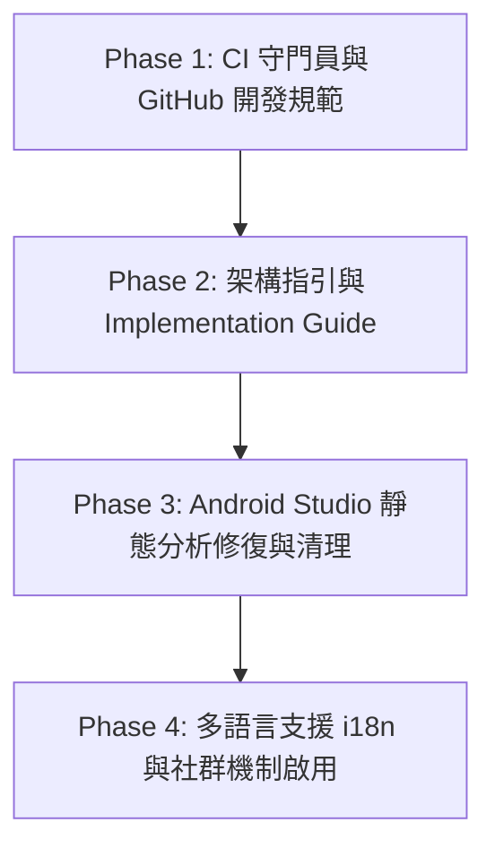

# ReLC 基礎建設、規範與品質強化計畫 (2026-09)

本文件記錄 ReLC 在發布初版（v0.1.0）後，接續開發後續功能前的基礎建設、架構治理、品質守門與規範強化執行藍圖。

---

## 🎯 目標

1. **守門自動化**：建立 PR CI 守門員，杜絕迴歸與壞代碼合入主線。
2. **架構標準化**：產出 Implementation Guide，明確定義模組邊界、依賴注入規範與測試縫隙（Testing Seams）設計，消除不良開發慣性。
3. **品質清零**：分批修復 Android Studio 靜態分析（Inspections）警告。
4. **社群化打底**：完善 GitHub 協作流程（Issue Templates, 分支策略, Discussions 與表態機制）。
5. **全球化準備**：建構多語言（i18n）架構。

---

## 🗺️ 分期執行藍圖 (Phases)

---

### 📌 Phase 1：CI 守門員與 GitHub 開發規範

* [x] **1.1 建立 PR 驗證工作流（`.github/workflows/ci.yml`）**
  * Android 單元測試（`./gradlew test`）。
  * VS Code 擴充套件單元測試（`npm test`）。
  * 保持既有之 `lua-stub-sync.yml` 守門員。
* [x] **1.2 建立 GitHub Issue Templates（`.github/ISSUE_TEMPLATE/`）**
  * `bug_report.yml`（含 Android 版本、Shizuku 狀態、裝置型號）。
  * `feature_request.yml`（需求描述、使用情境）。
  * `config.yml`（引導至 Discussions 詢問問題）。
* [x] **1.3 制定分支與協作規範（`CONTRIBUTING.md`）**
  * 分支策略：`master` 保持隨時可發布狀態；功能開發走 feature branch -> PR -> CI 驗證 -> 合併。
  * Commit Message 風格規範（Conventional Commits）。
* [x] **1.4 建立專案路線圖（`ROADMAP.md`）**
  * 彙整短期與長期規劃，向開源社群公開里程碑。
* [x] **1.5 清理 Local-only 與 Agent 專用文件（Git Untracking）**
  * 將 `.agents/`、`CLAUDE.md`、`docs/agents/` 等本機開發/AI Agent 輔助檔案從 Git 追蹤中移除（`git rm -r --cached`），並在 `.gitignore` 中忽略，確保開源倉庫的乾淨與專業。

---

### 📌 Phase 2：架構指引（Implementation Guide）與測試規範

* [x] **2.1 建立 `docs/architecture/implementation-guide.md`**
  * **模組職責邊界**：
    * `:app`：UI (Compose)、ViewModel、Navigation、Room 資料持久化、Workbench 伺服器。
    * `:engine`：唯一接觸 JNI/C++ 的模組，包含 ScriptEngine、VisionMatcher、RelcV2Service 與 GLES 管線。
    * `:hidden-api` / `:hidden-api-contract`：隱藏 API 反射與跨 Android 版本相容性合約。
    * `vscode-extension`：TypeScript 遠端開發工具。
  * **依賴注入（Hilt）規範**：
    * 嚴格規範各 Scope 生命週期，禁止將臨時物件濫用 Singleton。
  * **狀態管理規範**：
    * 遵循單向資料流（UDF），以 `StateFlow` 作為 Single Source of Truth。
  * **可測試性與測試縫隙（Testing Seams）規範**：
    * 杜絕在生產代碼各處隨意塞入 ad-hoc 測試介面的習慣。
    * 明確規範何時使用 Fake 實作（如 `RecordingRelcService`），測試代碼與輔助型別的放置路徑。
  * **Native C++ 與 JNI 邊界約定**：
    * JNI 呼叫一律收斂至 `ScriptHost` 與 `LuaBindings`，禁止散落 native 方法。

---

### 📌 Phase 3：Android Studio Inspections 修復與清理

*來源報告：`/home/martin/Desktop/index.html`*

* [x] **3.1 Priority 1：安全性、潛在 Crash 與資源洩漏**
  * 修正 `WorkbenchAuthStore` 之 `String.format` Locale 安全性問題與 type inference。
  * 修正 `WorkbenchService` 之 `NsdManager.RegistrationListener` 命名與監聽器。
  * C++ native 層優化（`NativeImageReader` 回呼 `std::move`、`VisionMatcher` 字串路徑傳遞優化、清理 `GlesDistributor` 未使用宣告）。
  * 修正 Hidden API 註解與註解碼清理（`RunningTaskInfoHidden`、`PowerManagerHidden`）。
* [x] **3.2 Priority 2：Compose 效能與最佳化**
  * `VirtualDisplayMirror.kt`：改用 `mutableIntStateOf` 避免 boxing 開銷。
  * `DisplaysViewModel.kt`：移除未使用的 `@ApplicationContext context` 依賴。
  * 升級 `LocalLifecycleOwner` 至 `androidx.lifecycle.compose`。
  * 修正 `ScriptsScreen` Preview 硬編碼路徑。
* [x] **3.3 Priority 3：資源清理與 Deprecation 整理**
  * 移除未使用的 XML 資源（`dimens.xml`、`integers.xml`、未使用的 `colors.xml` 項目）。
  * 清理 17 個未使用的向量圖形 Drawables（Compose 已全面改用 Material Icons）。
  * 清理 `strings.xml` 中未使用的舊版範本字串。

---

### 📌 Phase 4：多語言支援（i18n）與社群機制啟用

* [ ] **4.1 多語言資源架構**
  * 預設 `app/src/main/res/values/strings.xml` 轉換為英文（全球標準）。
  * 建立 `values-zh-rTW/strings.xml`（繁體中文）與 `values-zh-rCN/strings.xml`（簡體中文）。
  * 掃描並確保 Compose UI 中所有文字皆走 `stringResource()`，無寫死字串。
* [ ] **4.2 啟用 GitHub 社群互動機制**
  * 開啟 GitHub Discussions 討論區。
  * 發布並置頂「ReLC 社群交流與需求許願（Feature Voting）」歡迎帖，供有興趣的使用者按表情表態與討論。
